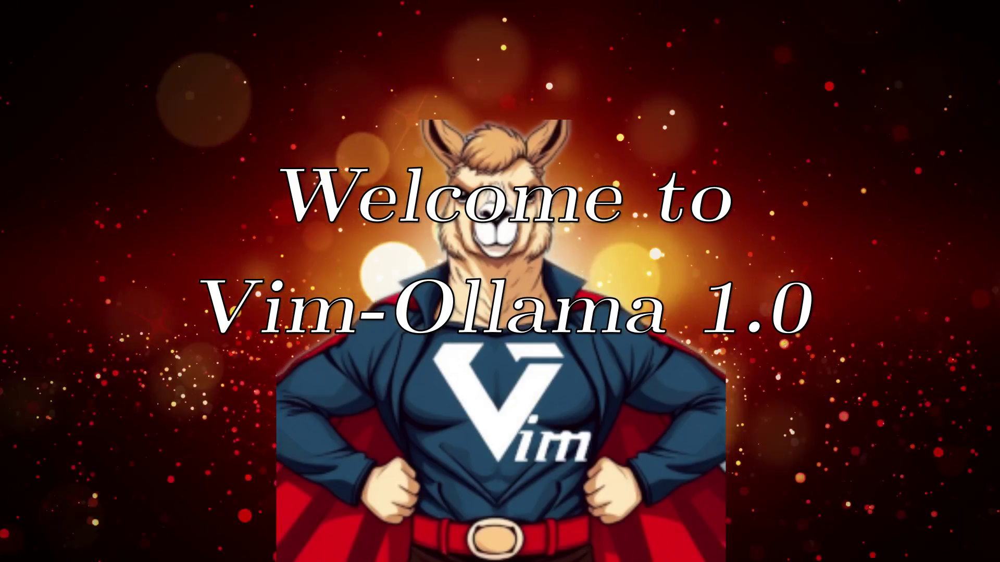
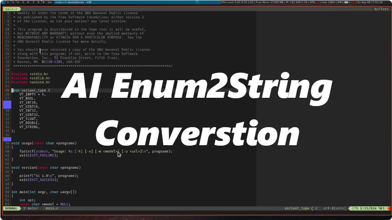
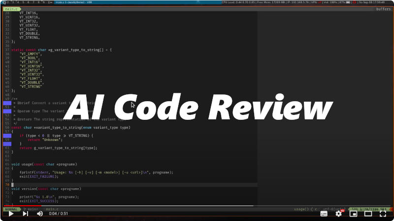
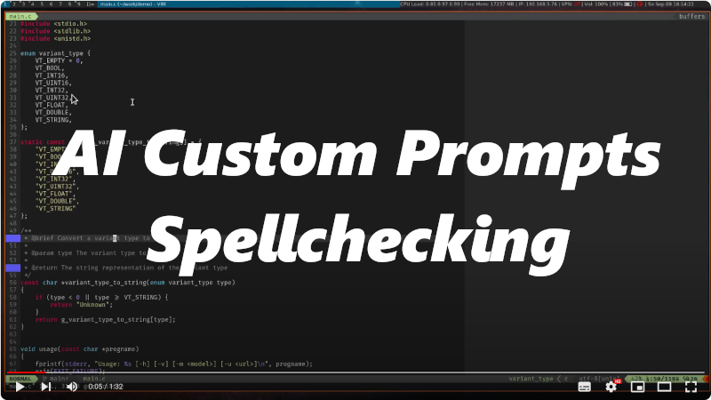

# Ollama Support for Vim

This plugin adds Copilot-like code completion support to Vim. It uses [Ollama](https://ollama.com) as a backend, which
can run locally and does not require cloud services, thus preserving your privacy.

<p align="center">

</p>

## Motivation

[Copilot.vim](https://github.com/github/copilot.vim) by Tim Pope is an excellent plugin for both Vim and NeoVim.
However, it is limited to Microsoft's Copilot, a commercial cloud-based AI that requires sending all your data to
Microsoft.

With Ollama and freely available LLMs (e.g., Llama3, Codellama, Deepseek-coder-v2, etc.), you can achieve similar
results without relying on the cloud. While other plugins are available, they typically require NeoVim, which isn't an
alternative for me. I prefer using Vim in the terminal and do not want to switch to NeoVim for various reasons.

## Features

- Intelligent AI-based code completion (aka tab completion)
- Integrated chat support for code reviews and other interactions
- Automatic code editing based on natural language (NEW in V1.0)
  - Supports inline-diff view for accepting changes interactively
  - Or accept without prompt for a Git based workflow using [vim-fugitive](https://github.com/tpope/vim-fugitive)
    (e.g. using `:Gvdiffsplit`)
- Python venv support for easier installation (NEW in V1.1)


## Screencasts

### Demo of Vim-Ollama 1.0

[](https://www.youtube.com/watch?v=adakWGm1BDs)

### Creating Enum to String Conversion function using AI

[](https://www.youtube.com/watch?v=G-ivVUXCKQk)

### Code Review

[](https://www.youtube.com/watch?v=kLkFr4rbPUo)

### Custom Prompts - Spellcheck Example

[](https://www.youtube.com/watch?v=aWEQTktv6fs)

## How It Works

The plugin uses Python scripts, e.g. `complete.py` and `chat.py`, to communicate with Ollama via its REST API. The first
script handles code completion tasks, while the second script is used for interactive chat conversations. The Vim plugin
uses these scripts via I/O redirection to integrate AI results into Vim.

Optionally, it supports also to use OpenAI REST API for code completion, chat
conversations and code edit tasks. Therefore, you need to create an OpenAI
account and create an OpenAI API key on https://platform.openai.com/api-keys to
be able to access the REST API. Export the environment variable
`OPENAI_API_KEY` with your key to make the Python library `openai` work.

> [!NOTE]
> This plugin supports Vim only, not NeoVim! If you're looking for a NeoVim plugin, check out
> [LLM](https://github.com/huggingface/llm.nvim).

## Requirements

> [!NOTE]
> Since V1.1.0 the plugin can create a Python virtual environment and install all dependencies
> automatically, when you run the setup wizard. This wizard is started automatically when you use
> the plugin for the first time. You can also use `:Ollama setup` to run it again.
> This section is kept for users who started with an older version. I recommend migrating
> to the new configuration, though. I might remove this section in the future, when the new
> venv support has proven to work well.

- Python 3.x
- Python package: `httpx>=0.23.3`, `requests`, `jinja2`, `openai` (optional)

### Debian-based Systems

If you're using a Debian-based distribution, you can install the required library directly:

```sh
sudo apt install python3-httpx python3-jinja2 python3-requests
```

### Other systems

System wide installation using `pip install` is not recommended,
use a virtual environment instead.

You need to run Vim from a shell with this Python environment to make this working.

Example:
```sh
python -m venv $HOME/vim-ollama
source $HOME/vim-ollama/bin/activate
pip install httpx>=0.23.3
pip install requests
pip install jinja2
```

Testing: You can test the python script on the shell to verify that it is working and all requirements are found.
The script should output a completion as shown below:

```sh
$> cd path/to/vim-ollama/python
$> echo -e 'def compute_gcd(x, y): <FILL_IN_HERE>return result' | ./complete.py -u http://localhost:11434 -m codellama:7b-code
  if x == 0:
    return y
  else:
    return compute_gcd(y % x, x)

def compute_lcm(x, y):
  result = (x * y) / compute_gcd(x, y)
```

## Installation

Install `gergap/vim-ollama` using vim-plug or any other plugin manager.

vim-plug example:
```vim
call plug#begin()
...
Plug 'gergap/vim-ollama'
call plug#end()
```

> [!NOTE]
> You can also install a plugin from a local path. This is useful for development
> or when installing the plugin without Internet access. When using the plugin offline,
> you also need to ensure all Python requirements are installed.

```vim
call plug#begin()
...
Plug '/path/to/vim-ollama'
call plug#end()
```
## First Run

Since V0.4, the plugin includes a setup wizard that helps you set up your
initial configuration. This is especially useful for new users who are not
familiar with Ollama or the different Open Source LLMs available.

The plugin will run the wizard automatically if the configuration file
`~/.vim/config/ollama.vim` does not yet exist. If you want to start the wizard
again, you can use the command `:Ollama setup` at any time, but be aware that
it will overwrite the configuration file at the end.


## Configuration

It is recommended to use the file `~/.vim/config/ollama.vim` for configuring Vim-Ollama,
but you can also override the settings in `~/.vimrc` as in previous versions.

Use the command `:Ollama config` to open the Vim-Ollama configuration file.

If you are migrating from previous versions, note that the FIM tokens are not configured anymore in Vim,
but in the bundled [JSON config files](python/configs). You can simply remove the old settings from your
`.vimrc`. The plugin should work with the most popular models out-of-the-box.

The most important variables: (see `:help vim-ollama` for more information)

| Variable              | Default                  | Description                            |
|-----------------------|--------------------------|----------------------------------------|
| `g:ollama_host`       | `http://localhost:11434` | The URL of the Ollama server.          |
| `g:ollama_model`      | `starcoder2:3b`          | The LLM for code completions.          |
| `g:ollama_edit_model` | `qwen2.5-coder:3b`       | The LLM for code editing tasks.        |
| `g:ollama_chat_model` | `llama3.1:8b`            | The LLM for chat conversations.        |

When adding new unsupported code completion models you will see an error like `ERROR - Config file .../python/configs/foobar.json not found.`.
Simply add this missing file and create a merge request to get it included upstream.
Consult the model's documentation to find out the correct tokens.

### OpenAI Configuration

**Environment Setup:**
Ensure that the environment variable `OPENAI_API_KEY` is correctly configured.
You can do this by setting it in your shell configuration, for example, in `~/.bashrc`
or by using your OS system settings dialog.

**Configuring Vim-Ollama:**
1. Open the Vim-Ollama configuration file using the command:
   ```vim
   :Ollama config
   ```
2. Add the following configuration to switch to the OpenAI backend:
   ```vim
   " OpenAI example configuration
   let g:ollama_model_provider = 'openai_legacy'
   let g:ollama_model = 'gpt-4.1-nano'
   let g:ollama_chat_provider = 'openai'
   let g:ollama_chat_model = 'gpt-4.1-mini'
   let g:ollama_edit_provider = 'openai'
   let g:ollama_edit_model = 'gpt-4.1-mini'
   ```
3. Ensure that the `openai` package is installed in your Python environment.
   Run the following command to update your Python environment:

   ```vim
   :Ollama pipinstall
   ```

> [!TIP]
> Code completion using the OpenAI REST API introduces a higher latency then running Ollama locally.
> It makes sense to use Ollama for code completion, and OpenAI only for more complex tasks like
> code review and code editing tasks.

### OpenAI/LMStudio Configuration

Configuring an own OpenAI compatible endpoint like LMStudio works similar to official OpenAI
endpoint but without an API key. The `g:ollama_openai_baseurl` variable is used to configure a
different base URL, which is `http://<hostname>:<port>/v1` for LMStudio.

   ```vim
    " LMStudio example configuration
    let g:ollama_openai_baseurl = 'http://localhost:1234/v1' " Use local OpenAI endpoint
    let g:ollama_model_provider = 'openai_legacy'
    let g:ollama_model = 'codegemma-2b'
    let g:ollama_chat_provider = 'openai'
    let g:ollama_chat_model = 'gpt-oss'
    let g:ollama_edit_provider = 'openai'
    let g:ollama_edit_model = 'gpt-oss'
   ```

## Usage

Simply start coding. The completions will appear as "ghost text" and can be accepted by pressing `<tab>`. To ignore
them, just continue typing or press `<C-]>` to dismiss the suggestion.

You can also accept just the one line using `<M-Right>` (Alt-Right) or one word
using `<M-C-Right>` (Alt-Ctrl-Right) if you don't want to use the complete suggestion.

To disable the default mappings use `:Ollama config` and change `g:ollama_no_maps` and/or `g:ollama_no_tab_map`.

See `:help vim-ollama` for more information.
